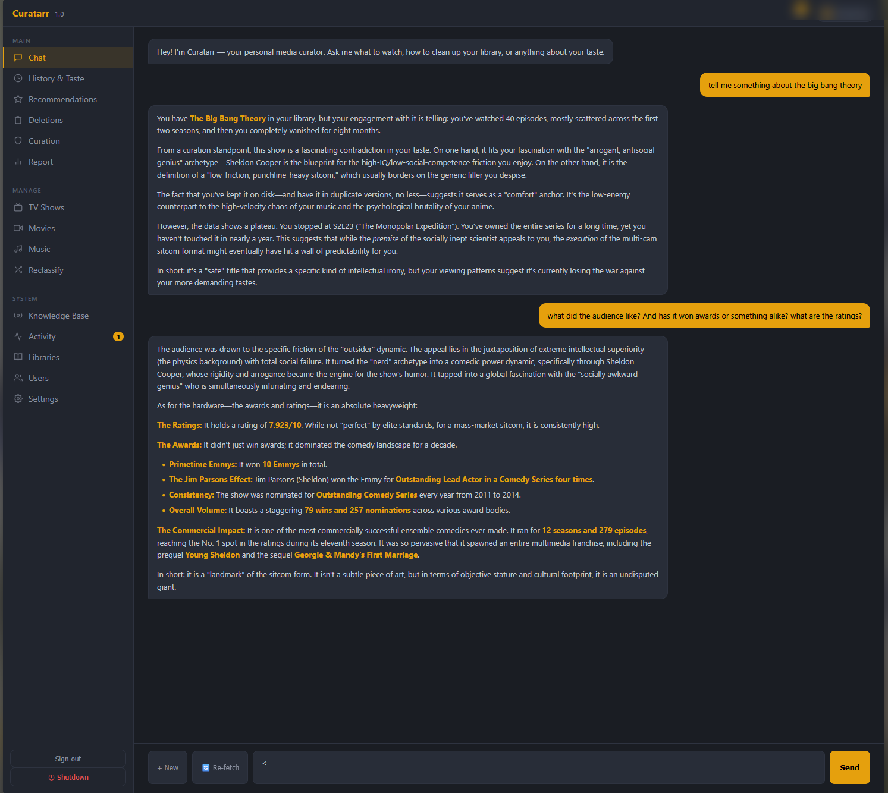
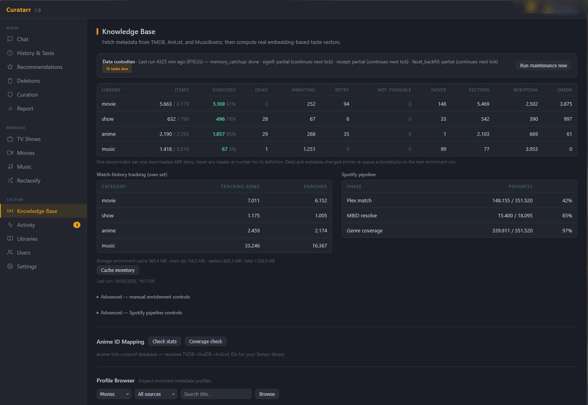
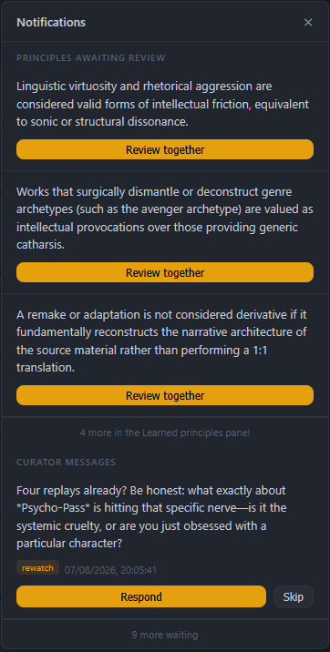

<div align="center">


# Curatarr

**A self-hosted AI curator for Plex and the \*arr stack.**

Curatarr learns what you actually watch, recommends what's worth adding,
and makes a reasoned case for what to delete — with every prompt running
on your own hardware.

[![License][badge-license]][link-license]
[![Tests][badge-tests]][link-tests]
[![Python][badge-python]][link-python]
[![Local LLM][badge-local]][link-ollama]
[![Platform][badge-platform]](#requirements)

</div>

> [!WARNING]
> **Curatarr can delete media.** Approving a deletion proposal removes the
> files from your Radarr / Sonarr / Lidarr libraries — permanently. Keep
> backups, review the analysis views before approving, and treat every
> approval as final. The software is provided as-is, without warranty.

---

## What it does

Most library tools tell you *what* you have. Curatarr forms an opinion
about it.

It sits between Plex, your \*arr services and a local [Ollama][link-ollama]
model, and continuously builds a per-user **taste vector** from real watch
history. Every title in your library gets enriched with real metadata —
creators, themes, awards, critical reception, cultural significance — and
embedded into a local vector store. From there the curator recommends,
proposes deletions, argues its case in chat, and keeps the whole thing
tidy on its own.

Nothing is sent to a hosted LLM. Nothing about your library leaves the
machine except the metadata lookups the enrichment pipeline needs.

## Preview



*Ask about anything you own. The answer is built from your real viewing
record — 40 episodes, scattered across two seasons, then abandoned for
eight months — and from verified facts, not from what a model
half-remembers about a title.*



*Enrichment coverage per library, what each metadata source has filled
in, the walkers still working through the backlog, and what the whole
thing costs on disk.*

<p align="center">
  
</p>

*Curatarr infers curation principles from the arguments you make with it
and puts them up for your approval before they influence any verdict —
and it speaks up when it notices a pattern worth asking about.*

## Features

- **Taste-aware recommendations** — from your own library or open-ended
  discovery, each with a written pitch explaining *why* it fits you.
- **Deletion proposals with an argument** — a 4-pillar judge (taste,
  household use, custodianship, resonance) rules KEEP / CUT / STAGNANT
  from verified evidence, then writes the case. Every proposal has its
  own discussion thread; titles without enrichment data are skipped
  rather than judged blind.
- **Semantic library search** — "like *X* but darker and more mature"
  resolves the anchor title, scores each constraint against real metadata
  tags, cites its evidence per hit, and admits when nothing in your
  library carries the full profile.
- **A curator that learns** — tell it once that you value a franchise, a
  partner's favourite, or archival oddities, and that preference softly
  protects similar titles in every future proposal.
- **Grounded, never hallucinated** — judgments reason from cached facts
  (TMDB, OMDb, AniList, MusicBrainz, Last.fm, Wikipedia), not from the
  model's own memory of a title.
- **It can hear the film** — deletion candidates carry measured dialogue
  signals from the actual subtitle track (words per minute, share of the
  runtime without dialogue, lexical variety), so the judge has evidence
  about *execution*, not just metadata — and a law that sparse dialogue
  is never thin writing. A discussion can pull the cleaned dialogue text
  itself into the conversation.
- **Multi-user** — every play is attributed to its Plex account; each
  user gets their own taste vector, recommendations, playlists and chat.
- **Writes back to Plex** — per-user "Curatarr Recommended" playlists
  (updated in place, not recreated) and rotating collection shelves.
- **Proactive messages** — a new season for something you binged, a
  strong pick for tonight, a check-in after a long break.
- **A data custodian instead of a button zoo** — ~20 maintenance tasks
  each carry a cadence and catch up whenever the machine is on. Every job
  reports live progress in the Activity view.
- **Self-healing library knowledge** — the profile audit requeues stale
  entries, rebuilds orphaned documents from cache, re-resolves corrupt
  id clusters, and refuses to mistake an unreachable service for a
  deleted library. A **Fix match** button permanently pins the right
  identity when two same-named works collide.
- **Game mode** — when a game starts, the models are evicted from VRAM
  and only keyless API pre-fetching continues. The pipeline resumes by
  itself afterwards.

## How it works

```
   Plex ──history──▶┌──────────────────────────────────┐
                    │            Curatarr              │
 *arr  ◀──manage───▶│                                  │
                    │  enrich ▶ embed ▶ taste vector   │
Metadata ──API────▶ │     │                    │       │
  APIs              │     ▼                    ▼       │
                    │  ChromaDB           recommend /  │
 Ollama ◀──prompts─▶│  + SQLite           judge / chat │
 (local)            └──────────────────────────────────┘
```

1. **Sync** — watch history is pulled from Plex and attributed per user.
2. **Enrich** — each title is resolved against the metadata APIs and
   given an LLM-written profile, then embedded into ChromaDB.
3. **Model taste** — profiles plus watch history plus your stated
   preferences become a per-user, per-category taste vector.
4. **Act** — that vector drives recommendations, deletion candidates,
   search ranking and the curator's side of every conversation.

The full technical reference — data model, pipeline internals, design
decisions and the invariants learned the hard way — lives in
[ARCHITECTURE.md](ARCHITECTURE.md).

---

## Getting started

### Requirements

| | |
|---|---|
| **Python** | 3.11 or newer |
| **Plex Media Server** | with an admin token |
| **[Ollama][link-ollama]** | running locally, GPU strongly recommended |
| **Radarr / Sonarr / Lidarr** | optional — unlocks deletion proposals per category |
| **TMDB API key** | recommended — the primary movie/show metadata source |
| **OMDb / Last.fm / Spotify keys** | optional — extra ratings, awards and music genres |

Recommended models: `gemma4:31b` as the *curator* — it won a five-model
benchmark on chat character and metadata faithfulness
([docs/BENCHMARKS.md](docs/BENCHMARKS.md) has the full data) —
`granite4.1:8b` as the fast *summariser*, and `nomic-embed-text-v2-moe`
for embeddings, which runs on CPU by design so the GPU stays free for the
curator. Any Ollama model can be substituted; the benchmark scripts ship
with the repo. AniList and MusicBrainz need no keys.

Sonarr and Radarr have stable API´s Lidarr is a bit of a hit or miss. Sometimes it works sometimes it even responds to our calls.
So please be patient with the backend when it tries to fetch anything from Lidarr. I am still trying to get the API to a more stable state but as the other two run fine it might just not be fixable on my end.

### Installation

**Windows**

```bat
git clone https://github.com/Randomname653/Curatarr.git curatarr
cd curatarr
python -m venv venv
venv\Scripts\activate
pip install -r requirements.txt
start.bat
```

`start.bat` is the development entry point: live console, hot reload, and
it self-heals missing dependencies and Ollama model bakes. For everyday
background use, `start_tray.bat` runs Curatarr as a tray icon with an
autostart toggle, log access and graceful shutdown.

**Linux / macOS**

```bash
git clone https://github.com/Randomname653/Curatarr.git curatarr
cd curatarr
python -m venv venv
source venv/bin/activate
pip install -r requirements.txt

python build_models.py     # first run: bake the curator + summariser tags
uvicorn src.main:app --host 0.0.0.0 --port 8000
```

### First run

Open `http://localhost:8000`. The setup wizard covers Plex sign-in
(PIN-based OAuth, no password), your Ollama models, \*arr connections,
external API keys, which Plex library maps to which category, and the
admin account. The first sync starts immediately and enrichment queues
itself from there.

> [!NOTE]
> Curatarr binds to `0.0.0.0` so other people in the household can reach
> it. It is built for a trusted home network — see [SECURITY.md](SECURITY.md)
> before exposing it anywhere else.

## Configuration

Settings live in `.env`, written by the setup wizard and editable by hand.
[`.env.example`](.env.example) documents every option with its default;
the ones most people touch:

| Env var | What it does |
|---|---|
| `PLEX_URL`, `PLEX_TOKEN` | Plex server and admin token |
| `OLLAMA_ENDPOINT` | Default `http://localhost:11434` |
| `BASE_CURATOR_MODEL` | Model baked into the `curatarr-curator` tag |
| `BASE_SUMMARIZER_MODEL` | Model baked into the `curatarr-summarizer` tag |
| `RADARR_URL` / `SONARR_URL` / `LIDARR_URL` (+ API keys) | \*arr connections |
| `TMDB_API_KEY` | Primary metadata source |
| `SYNC_INTERVAL_HOURS` | Plex history pull cadence (default 24) |
| `ENRICHMENT_TTL_DAYS` | How long an enriched profile stays fresh (default 90) |
| `EXTRA_GAME_PROCESSES` | Extra `.exe` names that should pause the LLM |

## Documentation

| Document | What's in it |
|---|---|
| [Usage guide](docs/USAGE.md) | Day-to-day operations, maintenance commands, troubleshooting |
| [Benchmarks](docs/BENCHMARKS.md) | How the models were chosen — method, data, and the raw scores |
| [Architecture](ARCHITECTURE.md) | Data flow, subsystem internals, design decisions, hard-won invariants |
| [Configuration reference](.env.example) | Every setting with defaults and comments |
| [Roadmap](ROADMAP.md) | What's planned and what's deliberately parked |
| [Changelog](CHANGELOG.md) | Condensed release history |
| [Contributing](CONTRIBUTING.md) | Dev setup, test conventions, code style |
| [Security](SECURITY.md) | Threat model and vulnerability reporting |

## Privacy

- **No hosted LLM.** Every prompt goes to your own Ollama instance.
- **Your history stays local.** SQLite and ChromaDB live under `data/`;
  that directory, `.env` and personal exports are all gitignored.
- **Titles go out, behaviour does not.** Enrichment queries public
  metadata APIs — TMDB, Wikipedia, Wikidata, Jikan, AniList, MusicBrainz,
  Last.fm, Deezer, Spotify — and most are searched by *name*, so those
  services learn which titles and artists your library holds. OMDb and
  OpenSubtitles are queried purely by id. What is never sent: what you
  watched, when, how often, your ratings, your taste profile, or anything
  you typed.
- **Subtitle sources are opt-in.** Dialogue signals come from the file
  Plex already holds whenever one exists. OpenSubtitles is only contacted
  if you configure a key, matched by IMDb id (no title guessing), under a
  daily budget you set. A self-hosted subtitle service can be slotted in
  between the two; nothing is bundled and none is assumed.
- **Data at rest is not encrypted by the app.** Watch history, taste
  vectors and chat live in plain SQLite under `data/` — on a trusted
  machine, by design. If disk theft is in your threat model, use OS disk
  encryption (BitLocker / LUKS); it protects everything at once, which no
  per-table scheme can.

## Contributing

Issues and pull requests are welcome — see [CONTRIBUTING.md](CONTRIBUTING.md)
for dev setup and conventions. The test battery is a single command and
CI runs exactly the same one:

```bash
python tests/run_all.py
```

## License

[GNU AGPL-3.0][link-license] — free to use, modify and self-host; derived
work and network-hosted forks must stay open source. Ported components
keep their original licenses, listed in
[THIRD_PARTY_LICENSES.md](THIRD_PARTY_LICENSES.md).

## Acknowledgements

- [SoulSync](https://github.com/Nezreka/SoulSync) — several robustness
  patterns (entity pins, playlist reconcile, staleness guards) are ported
  from it under MIT.
- [Ollama](https://ollama.com), [ChromaDB](https://www.trychroma.com) and
  [FastAPI](https://fastapi.tiangolo.com) carry the stack.
- The [\*arr](https://wiki.servarr.com) projects and
  [Plex](https://www.plex.tv), which Curatarr is useless without.
- Metadata from [TMDB](https://www.themoviedb.org),
  [OMDb](https://www.omdbapi.com), [AniList](https://anilist.co),
  [MusicBrainz](https://musicbrainz.org), [Last.fm](https://www.last.fm)
  and [Wikipedia](https://www.wikipedia.org).

> This product uses the TMDB API but is not endorsed or certified by TMDB.

<!-- badges -->
[badge-license]: https://img.shields.io/badge/license-AGPL--3.0-blue
[badge-tests]: https://github.com/Randomname653/Curatarr/actions/workflows/tests.yml/badge.svg
[badge-python]: https://img.shields.io/badge/python-3.11%2B-blue
[badge-local]: https://img.shields.io/badge/LLM-100%25%20local-E5A00D
[badge-platform]: https://img.shields.io/badge/platform-Windows%20%7C%20Linux%20%7C%20macOS-lightgrey
[link-license]: LICENSE
[link-tests]: https://github.com/Randomname653/Curatarr/actions/workflows/tests.yml
[link-python]: https://www.python.org/downloads/
[link-ollama]: https://ollama.com
