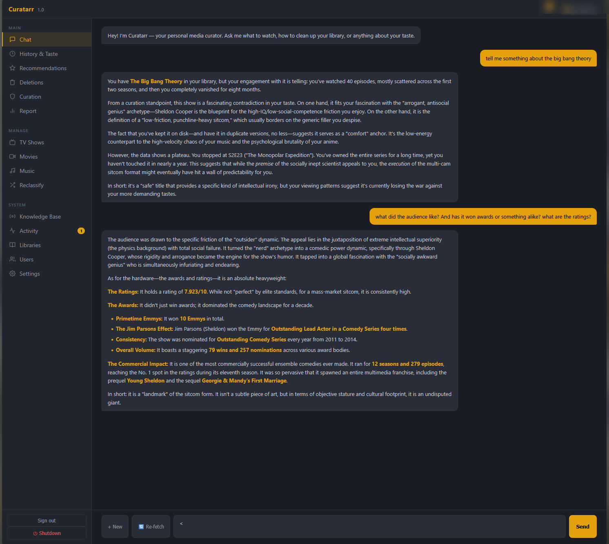
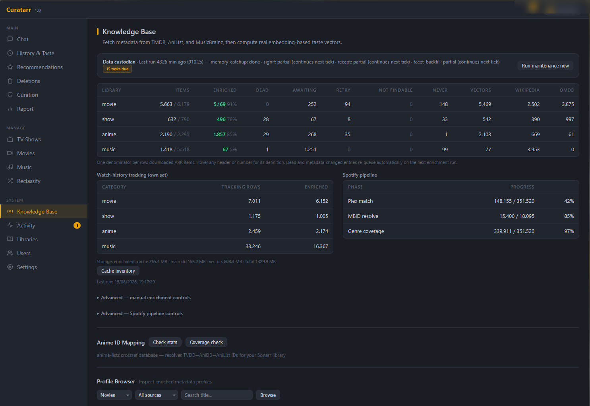
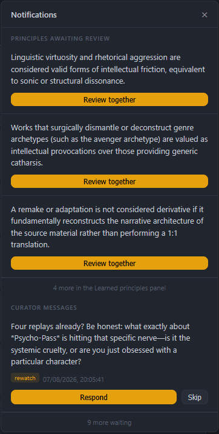

<div align="center">


# Curatarr

**A self-hosted AI curator for Plex and the \*arr stack.**

Curatarr learns what you actually watch, recommends what's worth adding,
and makes a reasoned case for what to delete — with every prompt running
on your own hardware.

[![License][badge-license]][link-license]
[![Tests][badge-tests]][link-tests]
[![OpenSSF Scorecard][badge-scorecard]][link-scorecard]
[![OpenSSF Best Practices][badge-cii]][link-cii]
[![Python][badge-python]][link-python]
[![Local LLM][badge-local]][link-ollama]
[![Platform][badge-platform]](#requirements)

</div>

> [!WARNING]
> **Curatarr can delete media.** Approving a deletion proposal removes the
> files from your Radarr / Sonarr / Lidarr libraries — permanently. Keep
> backups, review the analysis views before approving, and treat every
> approval as final. The software is provided as-is, without warranty.

> [!IMPORTANT]
> **This codebase is at least two-thirds vibe-coded.** Practically every
> line by now — apart from the original, very basic code ideas — across
> backend, frontend, tests, and part of this README was written by AI
> (Claude, Gemini, local models, plus automated review bots), directed,
> live-tested and decided
> on by a human operator running it daily against his own household's
> real library. That should factor into your risk calculus; it factors
> into ours. What earns trust here is not authorship but process: the
> test battery CI runs on every push, CodeQL, adversarial review passes,
> and a [changelog](CHANGELOG.md) that documents the failures as
> thoroughly as the features. Read it and judge for yourself.

---

## What it does

Most library tools tell you *what* you have. Curatarr forms an opinion
about it.

It sits between Plex, your \*arr services and a local [Ollama][link-ollama]
model, and continuously builds a per-user **taste vector** from real watch
history. Every title in your library gets enriched with real metadata —
creators, themes, awards, critical reception, cultural significance — and
embedded into a local vector store. From there the curator recommends,
proposes deletions, argues its case in chat, and keeps the whole thing
tidy on its own.

Nothing is sent to a hosted LLM. Nothing about your library leaves the
machine except the metadata lookups the enrichment pipeline needs.

## Preview



*Ask about anything you own. The answer is built from your real viewing
record — 40 episodes, scattered across two seasons, then abandoned for
eight months — and from verified facts, not from what a model
half-remembers about a title.*



*Enrichment coverage per library, what each metadata source has filled
in, the walkers still working through the backlog, and what the whole
thing costs on disk.*

<p align="center">
  
</p>

*Curatarr infers curation principles from the arguments you make with it
and puts them up for your approval before they influence any verdict —
and it speaks up when it notices a pattern worth asking about.*

## Features

- **Taste-aware recommendations** — from your own library or open-ended
  discovery, each with a written pitch explaining *why* it fits you.
- **Deletion proposals with an argument** — a 4-pillar judge (taste,
  household use, custodianship, resonance) rules KEEP / CUT / STAGNANT
  from verified evidence, then writes the case. Every proposal has its
  own discussion thread; titles without enrichment data are skipped
  rather than judged blind.
- **Semantic library search** — "like *X* but darker and more mature"
  resolves the anchor title, scores each constraint against real metadata
  tags, cites its evidence per hit, and admits when nothing in your
  library carries the full profile.
- **A curator that learns** — tell it once that you value a franchise, a
  partner's favourite, or archival oddities, and that preference softly
  protects similar titles in every future proposal.
- **Grounded, never hallucinated** — judgments reason from cached facts
  (TMDB, OMDb, AniList, MusicBrainz, Last.fm, Wikipedia), not from the
  model's own memory of a title.
- **It can hear the film** — deletion candidates carry measured dialogue
  signals from the actual subtitle track (words per minute, share of the
  runtime without dialogue, lexical variety), so the judge has evidence
  about *execution*, not just metadata — and a law that sparse dialogue
  is never thin writing. A discussion can pull the cleaned dialogue text
  itself into the conversation.
- **Multi-user** — every play is attributed to its Plex account; each
  user gets their own taste vector, recommendations, playlists and chat.
- **Writes back to Plex** — per-user "Curatarr Recommended" playlists
  (updated in place, not recreated) and rotating collection shelves.
- **Proactive messages** — a new season for something you binged, a
  strong pick for tonight, a check-in after a long break.
- **A data custodian instead of a button zoo** — ~20 maintenance tasks
  each carry a cadence and catch up whenever the machine is on. Every job
  reports live progress in the Activity view.
- **Self-healing library knowledge** — the profile audit requeues stale
  entries, rebuilds orphaned documents from cache, re-resolves corrupt
  id clusters, and refuses to mistake an unreachable service for a
  deleted library. A **Fix match** action (in a proposal card's More menu,
  or Search & pin in the Knowledge Base) permanently pins the right
  identity when two same-named works collide.
- **Game mode** — when a game starts, the models are evicted from VRAM
  and only keyless API pre-fetching continues. The pipeline resumes by
  itself afterwards.

## How it works

```
   Plex ──history──▶┌──────────────────────────────────┐
                    │            Curatarr              │
 *arr  ◀──manage───▶│                                  │
                    │  enrich ▶ embed ▶ taste vector   │
Metadata ──API────▶ │     │                    │       │
  APIs              │     ▼                    ▼       │
                    │  ChromaDB           recommend /  │
 Ollama ◀──prompts─▶│  + SQLite           judge / chat │
 (local)            └──────────────────────────────────┘
```

1. **Sync** — watch history is pulled from Plex and attributed per user.
2. **Enrich** — each title is resolved against the metadata APIs and
   given an LLM-written profile, then embedded into ChromaDB.
3. **Model taste** — profiles plus watch history plus your stated
   preferences become a per-user, per-category taste vector.
4. **Act** — that vector drives recommendations, deletion candidates,
   search ranking and the curator's side of every conversation.

The full technical reference — data model, pipeline internals, design
decisions and the invariants learned the hard way — lives in
[ARCHITECTURE.md](ARCHITECTURE.md).

---

## Getting started

### Requirements

Curatarr runs directly on the host; there is no Docker image. Windows is
the main platform (the launchers and the tray app are Windows-only);
Linux and macOS run the server by hand. Ollama may run on another
machine (`OLLAMA_ENDPOINT`).

| | |
|---|---|
| **Python** | 3.12 or newer |
| **[Git](https://git-scm.com)** | to clone the repository and to update it |
| **Plex Media Server** | you sign in as the server owner during setup |
| **[Ollama][link-ollama]** | installed and running before the first start |
| **GPU** | 24 GB VRAM for the default curator model. Smaller card? Pick a smaller curator model ([how](docs/USAGE.md#changing-the-models)); verdicts get softer |
| **Disk** | room for the models: the default curator alone is about 19 GB |
| **Radarr / Sonarr / Lidarr** | optional — each one unlocks deletion proposals and adds for its category |
| **Plex music index** | nothing to set up — without Lidarr, music runs on your Plex library |
| **TMDB API key** | recommended — the primary movie/show metadata source |
| **OMDb / Last.fm / Spotify keys** | optional — extra ratings, awards and music genres |

AniList and MusicBrainz need no keys. Every key can be added later in
Settings.

**Models.** The defaults are `gemma4:31b` as the *curator* (it won a
five-model benchmark on chat character and metadata faithfulness — see
[docs/BENCHMARKS.md](docs/BENCHMARKS.md)), `granite4.1:8b` as the fast
*summarizer*, and `nomic-embed-text-v2-moe` for embeddings, which runs on
the CPU so the GPU stays free for the curator. The first start downloads
whatever is missing. Any Ollama model can be substituted: on a card with
less than 24 GB, pick a smaller curator in the setup wizard's Ollama step,
or see [Changing the models](docs/USAGE.md#changing-the-models).

> [!NOTE]
> **Lidarr is optional, and the least reliable of the three.** Radarr and
> Sonarr answer consistently; Lidarr's API often answers slowly or not at
> all, so screens that wait on it can stall. Without Lidarr, Curatarr
> indexes your Plex music library itself: deletion proposals, deletions
> (through Plex's *Allow media deletion* setting) and a Wanted list in
> place of adds.

### Installation

**Windows**

1. Make sure Ollama is running (its icon sits in the system tray).
2. Clone the repository and create a virtual environment for Curatarr:

   ```bat
   git clone https://github.com/Randomname653/Curatarr.git curatarr
   cd curatarr
   py -3.12 -m venv venv
   ```

3. Start it:

   ```bat
   start.bat
   ```

The first start takes a while. `start.bat` installs the tested
dependencies into `venv`, then downloads and builds the Ollama models
(the default curator alone is about 19 GB). You don't need to activate
the venv or run `pip` yourself. When the console shows this line,
Curatarr is up and your browser opens on it:

```text
 Running at http://localhost:8000  |  Press Ctrl+C to stop
```

> [!TIP]
> `start.bat` keeps a console window open and reloads itself when the
> code changes. For everyday use, start Curatarr with `start_tray.bat`
> instead: it runs in the background as a tray icon, with an autostart
> toggle, log access and a clean shutdown. Both use the same `venv`.

**Linux / macOS**

```bash
git clone https://github.com/Randomname653/Curatarr.git curatarr
cd curatarr
python3 -m venv venv     # Python 3.12 or newer
source venv/bin/activate
pip install -r requirements.txt
python build_models.py
python -m uvicorn src.main:app --host 0.0.0.0 --port 8000
```

`build_models.py` downloads the base models and builds Curatarr's own
model tags from them. It takes a while the first time. Curatarr is up when
uvicorn prints `Application startup complete.` There is no launcher on
these platforms, so after every update repeat the `pip install` line and
restart.

### First run

1. Open `http://localhost:8000` on the machine running Curatarr. The
   setup wizard opens.
2. Work through the wizard: Plex sign-in (Curatarr opens plex.tv in a
   new tab for you to approve, or you enter the code it shows at
   plex.tv/link; no password), the Ollama models, the \*arr connections, API keys,
   which Plex library holds which category, and the admin account. Sign
   in with the Plex account that **owns** the server, because the first
   account becomes the admin.
3. When the wizard finishes, the first Plex sync starts. Enrichment
   queues itself after it; follow it in **Activity** in the sidebar.

Curatarr is useful right away and gets better as enrichment catches up
with your library, which takes hours to days.
[The first few days](docs/USAGE.md#the-first-few-days) explains what to
expect.

> [!NOTE]
> **Setting up from another device?** Until an admin account exists, a
> browser on any other device must enter a one-time **setup code**.
> Curatarr prints it in its console and log at every start:
> `No admin account yet. Setting up from ANOTHER device on the LAN (or through a reverse proxy) needs this one-time code: …`
> A browser on the Curatarr machine itself, opened at `http://localhost:8000`,
> never needs the code. Any other address — the machine's LAN IP or name, a
> reverse proxy, a web page that rebinds its name to 127.0.0.1 — must present it.

> [!NOTE]
> Curatarr binds to `0.0.0.0` so other people in the household can reach
> it at `http://<this-machine's-IP>:8000`. It is built for a trusted home
> network. Read [SECURITY.md](SECURITY.md) before you expose it anywhere
> else.

### Updating

Stop Curatarr (Ctrl+C in its console, or **Shutdown** in the tray menu),
then pull and start it again (on Linux / macOS, see the note under
their install steps):

```bat
git pull
start.bat
```

The launchers install changed dependencies and missing models on their
own, and the server migrates its database at startup. Your data in
`data/` and your `.env` are kept.

## Configuration

Settings live in `.env`. The setup wizard writes it, and most options can
also be changed in **Settings**. [`.env.example`](.env.example) documents
every option with its default. If you edit `.env` by hand, restart
Curatarr afterwards. These are the options most people change:

| Env var | What it does |
|---|---|
| `PLEX_URL`, `PLEX_TOKEN` | Plex server and admin token |
| `OLLAMA_ENDPOINT` | Default `http://localhost:11434` |
| `BASE_CURATOR_MODEL` | Model baked into the `curatarr-curator` tag |
| `BASE_SUMMARIZER_MODEL` | Model baked into the `curatarr-summarizer` tag |
| `RADARR_URL` / `SONARR_URL` / `LIDARR_URL` (+ API keys) | \*arr connections |
| `TMDB_API_KEY` | Primary metadata source |
| `SYNC_INTERVAL_HOURS` | Plex history pull cadence (default 24) |
| `ENRICHMENT_TTL_DAYS` | How long an enriched profile stays fresh (default 90) |
| `EXTRA_GAME_PROCESSES` | Extra `.exe` names that should pause the LLM |

## Documentation

| Document | What's in it |
|---|---|
| [Usage guide](docs/USAGE.md) | Day-to-day operations, maintenance commands, troubleshooting |
| [Benchmarks](docs/BENCHMARKS.md) | How the models were chosen — method, data, and the raw scores |
| [Architecture](ARCHITECTURE.md) | Data flow, subsystem internals, design decisions, hard-won invariants |
| [Configuration reference](.env.example) | Every setting with defaults and comments |
| [Roadmap](ROADMAP.md) | What's planned and what's deliberately parked |
| [Changelog](CHANGELOG.md) | Condensed release history |
| [Contributing](CONTRIBUTING.md) | Dev setup, test conventions, code style |
| [Security](SECURITY.md) | Threat model and vulnerability reporting |

## Privacy

- **No hosted LLM.** Every prompt goes to your own Ollama instance.
- **Your history stays local.** SQLite and ChromaDB live under `data/`;
  that directory, `.env` and personal exports are all gitignored.
- **Titles go out, behaviour does not.** Enrichment queries public
  metadata APIs — TMDB, Wikipedia, Wikidata, MyAnimeList (or Jikan), AniList, MusicBrainz,
  Last.fm, Deezer, Spotify — and most are searched by *name*, so those
  services learn which titles and artists your library holds. OMDb and
  OpenSubtitles are queried purely by id. What is never sent: what you
  watched, when, how often, your ratings, your taste profile, or anything
  you typed.
- **Subtitle sources are opt-in.** Dialogue signals come from the file
  Plex already holds whenever one exists. OpenSubtitles is only contacted
  if you configure a key, matched by IMDb id (no title guessing), under a
  daily budget you set. A self-hosted subtitle service can be slotted in
  between the two; nothing is bundled and none is assumed.
- **Data at rest is not encrypted by the app.** Watch history, taste
  vectors and chat live in plain SQLite under `data/` — on a trusted
  machine, by design. If disk theft is in your threat model, use OS disk
  encryption (BitLocker / LUKS); it protects everything at once, which no
  per-table scheme can.

## Contributing

Issues and pull requests are welcome — see [CONTRIBUTING.md](CONTRIBUTING.md)
for dev setup and conventions. The test battery is a single command and
CI runs exactly the same one:

```bash
python tests/run_all.py
```

## License

[GNU AGPL-3.0][link-license] — free to use, modify and self-host; derived
work and network-hosted forks must stay open source. Ported components
keep their original licenses, listed in
[THIRD_PARTY_LICENSES.md](THIRD_PARTY_LICENSES.md).

## Acknowledgements

- [SoulSync](https://github.com/Nezreka/SoulSync) — several robustness
  patterns (entity pins, playlist reconcile, staleness guards) are ported
  from it under MIT.
- [Ollama](https://ollama.com), [ChromaDB](https://www.trychroma.com) and
  [FastAPI](https://fastapi.tiangolo.com) carry the stack.
- The [\*arr](https://wiki.servarr.com) projects and
  [Plex](https://www.plex.tv), which Curatarr is useless without.
- Metadata from [TMDB](https://www.themoviedb.org),
  [OMDb](https://www.omdbapi.com), [AniList](https://anilist.co),
  [MusicBrainz](https://musicbrainz.org), [Last.fm](https://www.last.fm)
  and [Wikipedia](https://www.wikipedia.org).

> This product uses the TMDB API but is not endorsed or certified by TMDB.

<!-- badges -->
[badge-license]: https://img.shields.io/badge/license-AGPL--3.0-blue
[badge-tests]: https://github.com/Randomname653/Curatarr/actions/workflows/tests.yml/badge.svg
[badge-python]: https://img.shields.io/badge/python-3.12%2B-blue
[badge-local]: https://img.shields.io/badge/LLM-100%25%20local-E5A00D
[badge-platform]: https://img.shields.io/badge/platform-Windows%20%7C%20Linux%20%7C%20macOS-lightgrey
[badge-scorecard]: https://api.scorecard.dev/projects/github.com/Randomname653/Curatarr/badge
[link-scorecard]: https://scorecard.dev/viewer/?uri=github.com/Randomname653/Curatarr
[badge-cii]: https://www.bestpractices.dev/projects/14459/badge
[link-cii]: https://www.bestpractices.dev/projects/14459
[link-license]: LICENSE
[link-tests]: https://github.com/Randomname653/Curatarr/actions/workflows/tests.yml
[link-python]: https://www.python.org/downloads/
[link-ollama]: https://ollama.com
